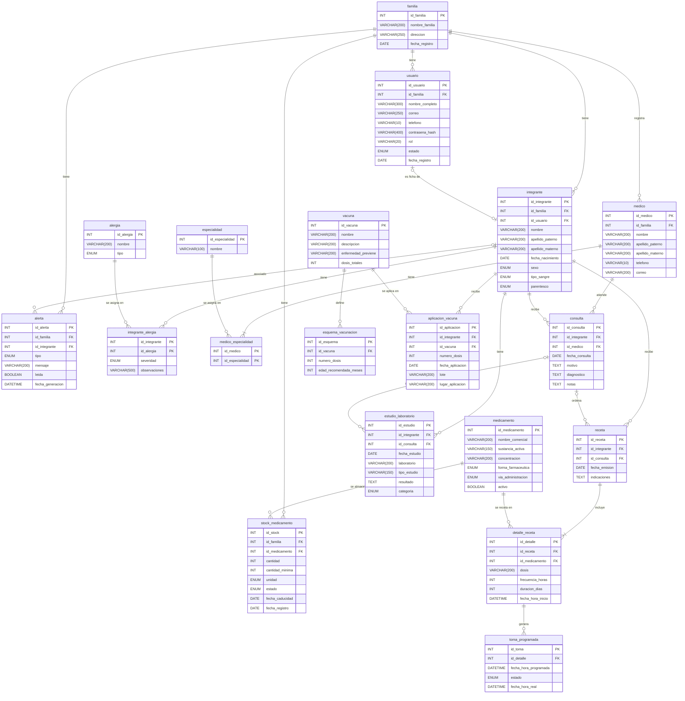

# Gestor de salud familiar, Historial medico y vacunación.

```mermaid


erDiagram

    familia ||--o{ usuario : tiene 
    familia ||--o{ integrante : tiene
    usuario |o--o| integrante : "es ficha de"

    familia ||--o{ alerta : tiene
    integrante |o--o{ alerta : asociado

    integrante ||--o{ integrante_alergia : tiene
    alergia ||--o{ integrante_alergia : "se asigna en"
    
    familia ||--o{ stock_medicamento : tiene
    medicamento ||--o{ stock_medicamento : "se almacena en"

    medico ||--|{ medico_especialidad : tiene
    especialidad ||--o{ medico_especialidad : "se asigna en"

    medico ||--o{ consulta : atiende
    integrante ||--o{ consulta : recibe
    
    vacuna ||--o{ esquema_vacunacion : define
    integrante ||--o{ aplicacion_vacuna : recibe
    vacuna ||--o{ aplicacion_vacuna : "se aplica en"

    integrante ||--o{ estudio_laboratorio : tiene
    consulta |o--o{ estudio_laboratorio : solicita
    integrante ||--o{ receta : recibe
    consulta |o--o{ receta : ordena
    
    receta ||--|{ detalle_receta : incluye
    medicamento ||--o{ detalle_receta : "se receta en"
    detalle_receta ||--o{ toma_programada : genera

    familia ||--o{ medico : registra


    familia {
        INT id_familia PK
        VARCHAR(200) nombre_familia
        VARCHAR(250) direccion
        DATE fecha_registro
    }

    integrante {
        INT id_integrante PK
        INT id_familia FK
        INT id_usuario FK
        VARCHAR(200) nombre
        VARCHAR(200) apellido_paterno
        VARCHAR(200) apellido_materno
        DATE fecha_nacimiento
        ENUM sexo
        ENUM tipo_sangre
        ENUM parentesco
    }

    usuario {
        INT id_usuario PK
        INT id_familia FK
        VARCHAR(300) nombre_completo
        VARCHAR(250) correo
        VARCHAR(10) telefono
        VARCHAR(400) contrasena_hash
        VARCHAR(20) rol
        ENUM estado
        DATE fecha_registro
    }

    alerta{
        INT id_alerta PK
        INT id_familia FK
        INT id_integrante FK
        ENUM tipo
        VARCHAR(200) mensaje
        BOOLEAN leida
        DATETIME fecha_generacion
    }

    alergia{
        INT id_alergia PK
        VARCHAR(200) nombre
        ENUM tipo
    }

    integrante_alergia{
        INT id_integrante PK
        INT id_alergia PK
        ENUM severidad
        VARCHAR(500) observaciones
    }

    medicamento{
        INT id_medicamento PK
        VARCHAR(200) nombre_comercial
        VARCHAR(150) sustancia_activa
        VARCHAR(200) concentracion
        ENUM forma_farmaceutica
        ENUM via_administracion
        BOOLEAN activo
    }

    stock_medicamento{
        INT id_stock PK
        INT id_familia FK
        INT id_medicamento FK
        INT cantidad
        INT cantidad_minima
        ENUM unidad
        ENUM estado
        DATE fecha_caducidad
        DATE fecha_registro
    }

    especialidad{
        INT id_especialidad PK
        VARCHAR(100) nombre
    }

    medico{
        INT id_medico PK
        INT id_familia FK
        VARCHAR(200) nombre
        VARCHAR(200) apellido_paterno
        VARCHAR(200) apellido_materno
        VARCHAR(10) telefono
        VARCHAR(200) correo
    }

    medico_especialidad{
        INT id_medico PK
        INT id_especialidad PK
    }

    consulta{
        INT id_consulta PK
        INT id_integrante FK
        INT id_medico FK
        DATE fecha_consulta
        TEXT motivo
        TEXT diagnostico
        TEXT notas        
    }

    vacuna{
        INT id_vacuna PK
        VARCHAR(200) nombre
        VARCHAR(200) descripcion
        VARCHAR(200) enfermedad_previene
        INT dosis_totales
    }

    esquema_vacunacion{
        INT id_esquema PK
        INT id_vacuna FK
        INT numero_dosis
        INT edad_recomendada_meses  
    }

    aplicacion_vacuna{
        INT id_aplicacion PK
        INT id_integrante FK
        INT id_vacuna FK
        INT numero_dosis
        DATE fecha_aplicacion
        VARCHAR(200) lote
        VARCHAR(200) lugar_aplicacion
    }

    estudio_laboratorio{
        INT id_estudio PK
        INT id_integrante FK
        INT id_consulta FK
        DATE fecha_estudio
        VARCHAR(200) laboratorio
        VARCHAR(150) tipo_estudio
        TEXT resultado
        ENUM categoria
    }

    receta{
        INT id_receta PK
        INT id_integrante FK
        INT id_consulta FK
        DATE fecha_emision
        TEXT indicaciones
    }

    detalle_receta{
        INT id_detalle PK
        INT id_receta FK
        INT id_medicamento FK
        VARCHAR(200) dosis
        INT frecuencia_horas
        INT duracion_dias
        DATETIME fecha_hora_inicio
    }

    toma_programada{
        INT id_toma PK
        INT id_detalle FK
        DATETIME fecha_hora_programada
        ENUM estado
        DATETIME fecha_hora_real
    }
```